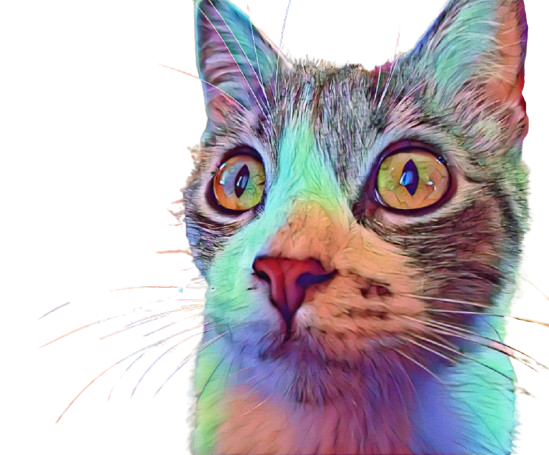

<!-- HEADER CON GRADIENTE -->
<h1 style="font-size: 72px; font-weight: 900; background: linear-gradient(90deg, #00FFFF 0%, #FF00FF 25%, #00FF88 50%, #FF1493 75%, #9D00FF 100%); -webkit-background-clip: text; -webkit-text-fill-color: transparent; background-clip: text;">
  Viviana Laura
</h1>

<h3 style="font-size: 32px; background: linear-gradient(90deg, #00FFFF 0%, #FF00FF 50%, #00FF88 100%); -webkit-background-clip: text; -webkit-text-fill-color: transparent; background-clip: text; letter-spacing: 4px;">
  💻 PROGRAMMER
</h3>

 

  

<!-- CONTACTO -->

 

---

 

## 💻 Tech Stack

